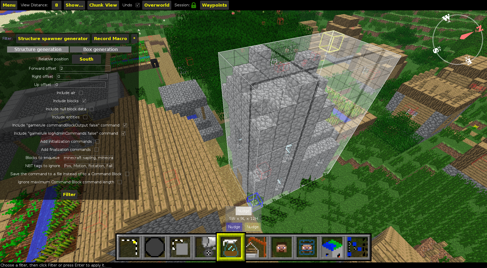

# Structure spawner generator #
(Download: [MC 1.11+](https://github.com/xMamo/Structure-spawner-generator/releases/latest) | [older versions](https://github.com/xMamo/Structure-spawner-generator/releases/tag/v1.3.3))

Structure spawner generator is a simple MCEdit filter to convert any Minecraft
structure to a single command which spawns the structure itself.


## Installation ##
To install Structure spawner generator as a MCEdit filter, simply download
`structure_spawner_generator.py` from
[here](https://github.com/xMamo/Structure-spawner-generator/releases/latest).
Start up MCEdit and click on the `Config Files` button: MCEdit's configuration
directory will be opened. Open the `Filters` subfolder. Inside, put the file
you just downloaded.


## Usage ##
Once you've opened the desired level inside of MCEdit, go ahead and select the
structure you want to turn into a command. Click on the `Filter` item and from
the `Filter` drop-down select `Structure spawner generator`. You should get
something like this:



Tweak the settings as you wish, and when you're done, press `Filter`. If
`Save the command to a file instead of to a Command Block` isn't selected,
you'll see that a Command Block ready to be imported will be on the upper
right of the MCEdit window. Click on it and import it wherever you wish: the
Command Block will contain the command to spawn the structure!


### Filter options ###
#### `Structure generation` ###
 - **`Relative position`, `Forward offset`, `Left offset` and `Up offset`**:
   these options determine where the structure will be spawned relative to
   command execution point.
 - **`Include air`**: should air blocks be explicitly placed when the
   structure gets spawned? For example, if the structure gets spawned on an
   uneven terrain, should the area be cleared first?
 - **`Include blocks` and `Include entities`**: these two options behave in a
   pretty similar way. If `Include blocks` is enabled, you can choose if you
   want to spawn selected entities along with the structure using `Include
   entities`. If you want just to spawn the selected entities, select only
   `Include entities`.
 - **`Include null block data`**: if a block has 0 as data value and no data
   tag, it will be placed by the structure spawner using `setblock <x> <y> <z>
   <block>`. Enable this setting to place the block using `setblock <x> <y>
   <z> <block> 0` instead.
 - **`Include "gamerule commandBlockOutput false" command` and `Include
   "gamerule logAdminCommands false" command`**: if enabled, `gamerule
   commandBlockOutput false` and/or `gamerule logAdminCommands false`
   command(s) will be executed before spawning the structure. It is
   recommended to leave `Include "gamerule commandBlockOutput false" command`
   enabled, as it disables the chat spam that would come along structure
   spawning. Also, if the structure uses a lot of 10Hz+ Command Block clocks,
   it is recommended to enable `Include "gamerule logAdminCommands false"
   command` to avoid creating giant log files and console spamming.
 - **`Add initialization commands` and `Add finalization commands`**: these
   two options serve to execute certain commands before and/or after structure
   spawning. For example, it might me useful to set up some scoreboard
   objectives before the structure gets spawned. If one or both of this
   options is enabled, you will be prompted to select a file containing the
   commands you want to execute before/after spawning the structure. The
   selected file has to be a text file, containing one command per line.
 - **`Blocks to enqueue`**: some blocks depend on other blocks to exist. For
   example, a torch needs to be placed on a block. To make sure everything
   gets spawned correctly, `Blocks to enqueue` contains a list of crucial
   blocks which have to be placed once everything else got placed. The list
   should already be fine, however if you see one or more blocks popping off
   after structure spawning, you can add their ID here.
 - **`NBT tags to ignore`**: as you might know, some blocks (for example
   Command Blocks) require additional data through the use of so-called NBT
   tags (like the command contained in the Command Block, its state, …). To
   save on characters, some tags can safely be ignored. If you are an NBT pro,
   you'll find this option really useful to strip some tags you identify as
   useless.
 - **`Save the command to a file instead of to a Command Block`**: as the name
   suggests, if this option is enabled, the command to spawn the structure
   will be saved to a text file instead of to a Command Block. This option can
   be extremely useful, as the command saved to file will be formatted in such
   a way that it will be much easier to edit manually afterwards. If this
   option is enabled, you will be prompted to select a text file to which to
   save the command.
 - **`Ignore maximum Command Block command length`**: Command Blocks have a
   maximum command length of 32500 characters. If this limit gets exceeded,
   you get an error message and no command will be generated. However, if you
   think you have only slightly exceeded this limit, you can enable this
   option to take a look at the command and see what might could be done to
   make it less than 32501 characters long.

#### `Box generation` ####
 - **`Generate surrounding box`**: many One Command creations are just a bunch
   of Command Blocks enclosed by a box with some clickable signs on the front.
   If you are creating one of these One Commands, you could create this box
   yourself. However, this and the following options provide an easy way to do
   so without too much hassle. If  this option is enabled, the generated
   structure will be enclosed by a box of blocks.
 - **`Box wall material block`, `Box wall material data value`, `Box floor
   material block`, `Box floor material data value`, `Box ceiling material
   block` and `Box ceiling material data value`**: the materials to be used to
   generate the surrounding box.
 - **`Add box signs`**: if enabled, you will be prompted to select a text file
   describing the signs to be placed on the front of the box. The file has to
   have the following format:
   ```
   <x>, <y>
   <Text 1>
   <Text 2>
   <Text 3>
   <Text 4>
   <Command 1>
   <Command 2>
   <Command 3>
   <Command 4>
   
   [Repeat for as many times as needed]
   ```
   `<x>` and `<y>` determine the 2D-position of each sign on top of the front
   wall of the box. `0, 0` indicates the lower left of the wall.\
   `<Text n>` is the text to be placed on the n-th line of the sign. It can be
   an empty string, some text or a [JSON formatted string](https://minecraft.gamepedia.com/Commands#Raw_JSON_text).\
   When clicked, a sign can execute up to four commands. `<Command n>`
   determines the n-th command and can be empty if required.


## Resources ##
### Italian tutorial video by iMamoMC ###
[](https://www.youtube.com/watch?v=2OgVyotqJ4g)


### Updated  italian tutorial video by BisUmTo ###
[](https://www.youtube.com/watch?v=dEZx7OlfC7w)
